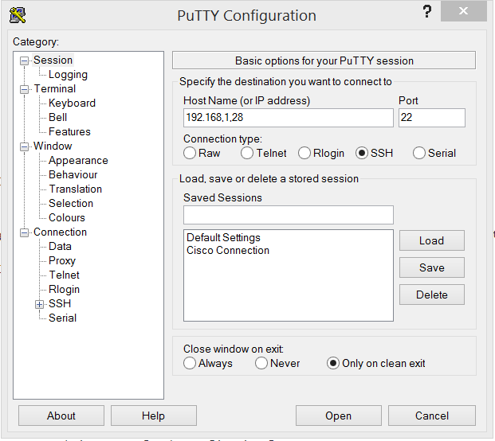

= Installing a Raspberry Pi Hole

Nick Turner

== Intro

The purpose of this tutorial is to show how to set up a Raspberry Pi as a DNS server known as a Pi Hole. This Pi Hole will be able to disable many different advertisements based on the advertiser's IP address. 

== Learning Objectives

* Install Rasbian to the Pi
* Remote into the Raspberry Pi using SSH
* Install Raspberry Pi Hole
* Explain why a Raspberry Pi may be useful

== Prerequisites

The "*" is a bulleted list. If this can only be done on a Windows computer, using Packet Tracer, or any other technology, list those prerequisites here.

* Raspberry Pi 
* Micro SD Card
* Micro SD Card Reader
* Micro USB power cable
* Keyboard and HDMI cable to configure the Raspberry Pi

== Instructions

== Step one - Install Raspian Stretch

* Raspbian Stretch is the newest version of the Raspberry Pi's operating system. Visit the below website to download the zip file for Stetch. 
 
```
https://www.raspberrypi.org/downloads/raspbian/
```

image::Stretch Download.png[]


* You'll also need to download software to flash the zip file to the micro sd card. You can download a flash software such sa BalenaEtcher to get the job done. Find the link to the download below. 

```
https://www.balena.io/etcher/
```
image::Etcher Download.png[]


* You will now need to plug in the USB micro SD card reader. The micro SD card should be in the reader. Open up Etcher and flash the download to the disk. If you've done so correctly, you'll get the something similar to the below screenshot.

image::Flashing with Etcher.png[]


 
* Put the micro SD card into the Raspberry Pi.
* Now that the image is flashed the the micro SD card, you're going to want to plug in a HDMI cable, keyboard, and a mouse into the Raspberry Pi. The goal is to be able to set up the Raspberry Pi from a monitor, but once we set a static IP address, we can install the Raspberry Pi hole remotely using SSH. 

* The Raspberry Pi 3 model B has built in wireless capabilities, but if your pi does not, you will need to invest in a wireless WiFi dongle. 


== Step two - SSH into the Pi

* First we need to enable SSH on the Rasberry Pi

```
sudo raspi-config
```

* Select "Interfacing Options"
* Select SSH
* Enable SSH by pressing Enter

image::enableSSH.png[]


== Step three - Set a Static IP on the Pi

* Open the terminal 
* You will want to run ifconfig and netstat to find your Default Gateway (your router's IPv4 address), Netmask, and a desired IP address for both wlan0 and eth0
* Edit the /etc/dhcpcd.conf file and add the following 

```
sudo nano /etc/dhcpcd.conf
```

* Here's what it should look like.


image::staticIP.png[]


* Reset the Raspberry Pi for changes to go into effect.

```
sudo reboot 0
```
* Open the command prompt and ping your Rasberry Pi's static IP to make sure the Pi is both on and has the IP set correctly.
* If you're successful, you should be able to ssh into the Pi.

image::ping.png[]

* Once your static IP is set, you can ssh into your Raspberry Pi using Putty



== Step four - Install the Pi Hole
== Step five - Set up the DNS Server
== Step six - Install a blacklist
+
```
sudo su
```
. Step four. Use the following syntax to include screenshots or other images. Note that the "+" is used to include additional content under this bullet point.
+

. Step five. Compile with the following command:
+
```
asciidoctor-pdf tutorial.adoc
```

== Challenge

* Can you find a way to secure the Raspberry Pi so that data is encrypted and safe?

Provide some meaningful ways for the learner to apply their knowledge in a new way.

Notice that a screenshot can be included in a separate paragraph without the "+".


== Reflection

* Why would you want to block ads on a network, besides the fact that they are annoying?
