= Installing a Raspberry Pi Hole

Nick Turner

== Intro

The purpose of this tutorial is to show how to set up a Raspberry Pi as a DNS server known as a Pi Hole. This Pi Hole will be able to disable many different advertisements based on the advertiser's IP address. 

== Learning Objectives

* Install Rasbian to the Pi
* Remote into the Raspberry Pi using SSH
* Install Raspberry Pi Hole
* Explain why a Raspberry Pi may be useful

== Prerequisites


* Raspberry Pi 
* Micro SD Card
* Micro SD Card Reader
* Micro USB power cable
* Keyboard and HDMI cable to configure the Raspberry Pi


== Step One - Install Raspian Stretch

* Raspbian Stretch is the newest version of the Raspberry Pi's operating system. Visit the below website to download the zip file for Stetch. 
 
```
https://www.raspberrypi.org/downloads/raspbian/
```

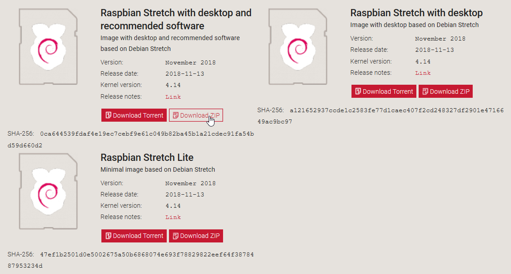


* You'll also need to download software to flash the zip file to the micro sd card. You can download a flash software such sa BalenaEtcher to get the job done. Find the link to the download below. 

```
https://www.balena.io/etcher/
```
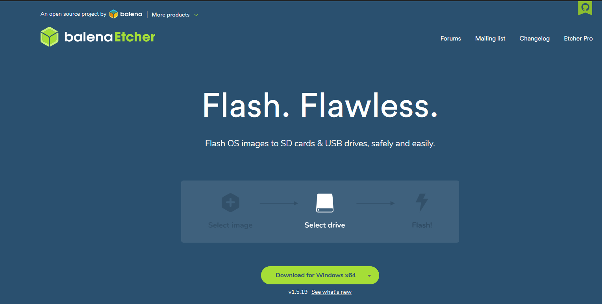


* You will now need to plug in the USB micro SD card reader. The micro SD card should be in the reader. Open up Etcher and flash the download to the disk. If you've done so correctly, you'll get the something similar to the below screenshot.

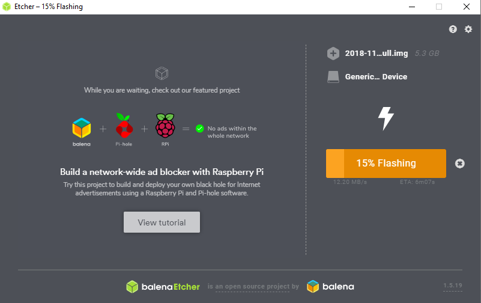


 
* Put the micro SD card into the Raspberry Pi.
* Now that the image is flashed the the micro SD card, you're going to want to plug in a HDMI cable, keyboard, and a mouse into the Raspberry Pi. The goal is to be able to set up the Raspberry Pi from a monitor, but once we set a static IP address, we can install the Raspberry Pi hole remotely using SSH. 

* The Raspberry Pi 3 model B has built in wireless capabilities, but if your pi does not, you will need to invest in a wireless WiFi dongle. 
* Follow the set up wizard and make sure to connect to your home network. 


== Step Two - Set a Static IP on the Pi

* Open the terminal 
* You will want to run ifconfig and netstat to find your Default Gateway (your router's IPv4 address), Netmask, and a desired IP address for both wlan0 and eth0
* Edit the /etc/dhcpcd.conf file with the following 

```
sudo nano /etc/dhcpcd.conf
```

* Here's what it should look like. The only information that should be different is my IPv4 information, subnet, and broadcast.


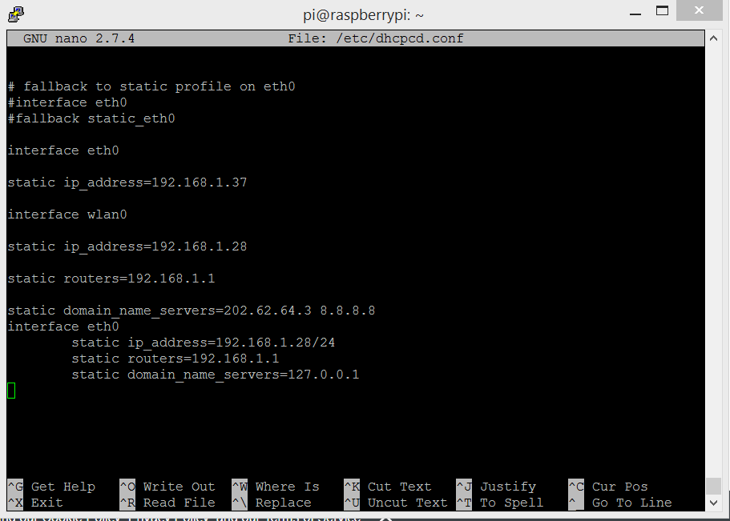


* Reset the Raspberry Pi for changes to go into effect.

```
sudo reboot 0
```

== Step Three - SSH into the Pi

* We need to enable SSH on the Rasberry Pi
* In the terminal, type the following

```
sudo raspi-config
```

* Select "Interfacing Options"
* Select SSH
* Enable SSH by pressing Enter

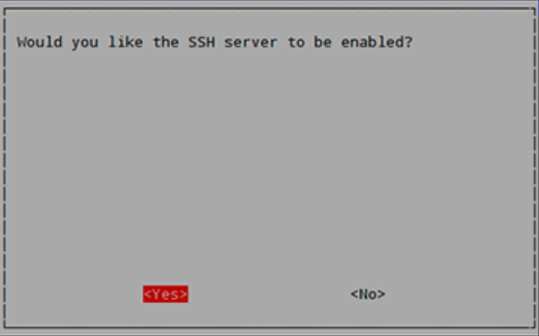

* Open the command prompt and ping your Rasberry Pi's static IP to make sure the Pi is both on and has the IP set correctly.
* Once your static IP is set, you can ssh into your Raspberry Pi using Putty
* Sign into your Pi using the credentials set up during installation of the Pi

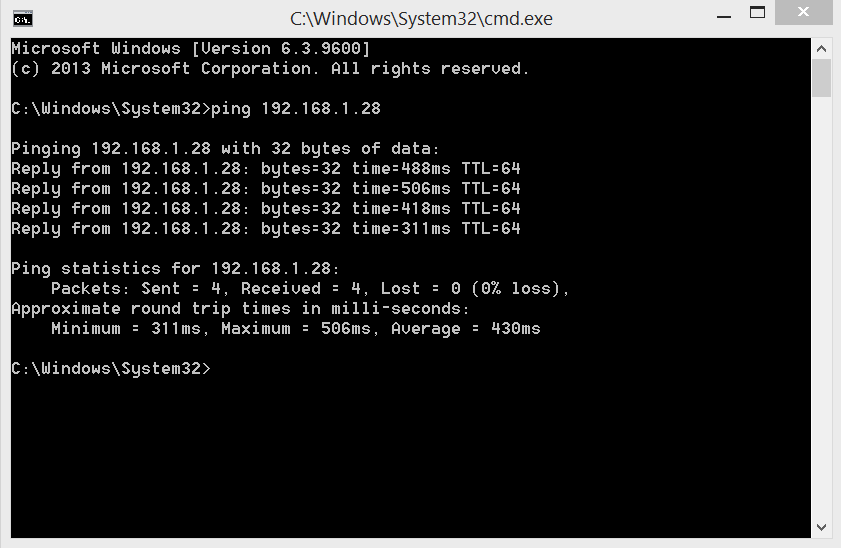

== Step four - Install the Pi Hole

* Open the terminal, whether through SSH or on a monitor
* In the terminal, install Raspberry Pi Hole

```
Sudo curl -sSL https://install.pi-hole.net | bash
```

* This step can take some time, but when the wizard becomes available, you can mostly just hit enter and accept things how they are. 
* When asked about your upstream providor, any are acceptable.
* Once the wizard is complete, you should see a banner that says "Installation Complete!" Make sure that you take note of the password so that you can log into the Pi Hole's web interface. 
* You should have the Pi Hole set up by now, so go to the web interface to start. Accomplish this by opening a browser on your preferred computer. Your web interface will be the static IP address of the Raspberry Pi /admin. Mine is listed below. 

```
192.168.1.28/admin
```
* You can now login using the password that you've saved earlier
* If you don't remember the pi hole password or didn't write it down (like I did) you can reset the pi hole's password with the following

```
pi hole -a -p
```

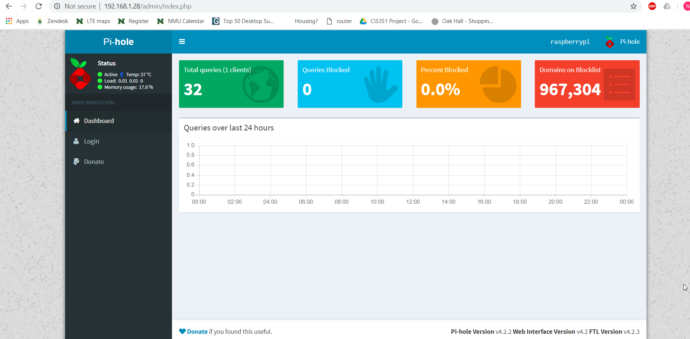

* Once signed in, you need to enable listening on all interfaces. 
* Go to Settings -> DNS -> Interface Listening Behavior -> Listen on all interfaces

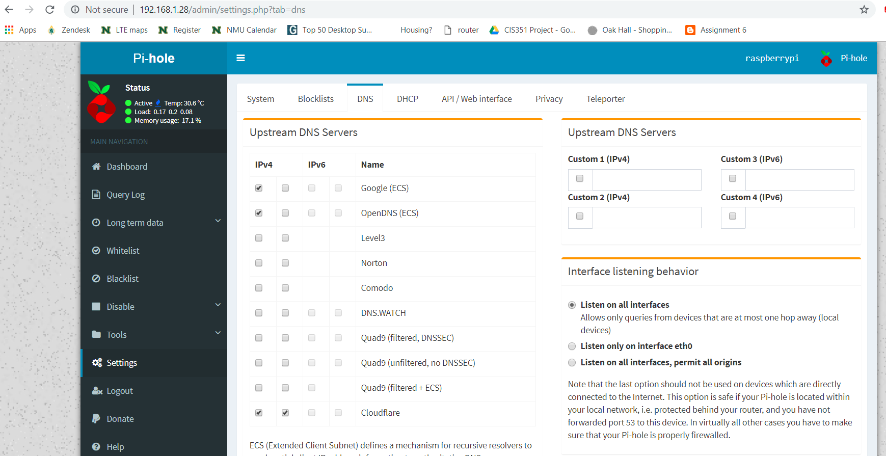


== Step five - Set up the DNS Server

* Your router naturally has a DNS server that is automatically enabled, so you will need to turn your ISP's DNS server off and enable yours as an alternate. My DNS settings are found under Basic Settings.
* This DNS server will send the advertisers a 'fake' IP address, that way many advertisements will never be loaded on a webpage to begin with
* Ever router has a different web interface, so it may be difficult to find. Just log into your router by typing it's IP address into the address bar. If you don't know the user name and password, you can likely find that information on the router. The login and username are probably just admin and password.

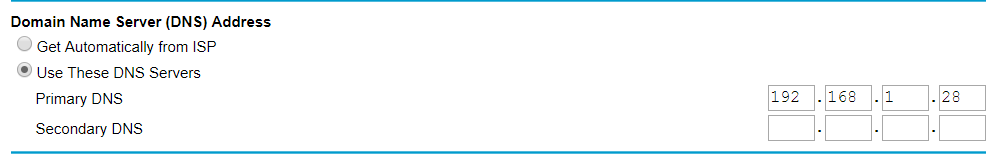

== Step six - Install a blacklist

* The Pi Hole needs a block list to know what to block. I use Wally's List to find a good ad blocking list. They include 3 different lists to choose from. One that basically blocks everything, one that blocks only some things, and one right in the middle. The choice is yours. I recommend choosing whichever one suits you, based on how much you want blocked on your home network. Go to the website and just copy and paste the block list to the Block List section under Settings in the Pi Hole's web interface. 

```
https://v.firebog.net/hosts/lists.php
```

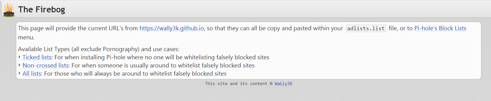

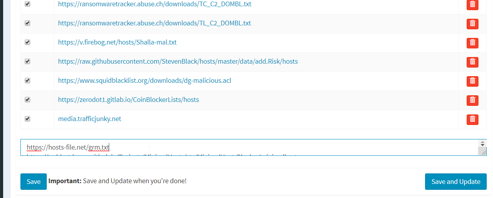

You're DNS server through the Raspberry Pi Hole should be configured at a very basic level and working!

== Challenge

* Can you find a way to secure the Raspberry Pi so that data is encrypted and safe?
* Put the Raspberry Pi on a VPN so that you can access the Pi Hole from anywhere

== Reflection

* Why would you want to block ads on a network, besides the fact that they are annoying?
* Why are web page advertisement blocked but not video ads, like on YouTube?
* Does having a Network wide ad blocker have any advantage over an adblocking applicaton such as AdBlock Plus? Why?
